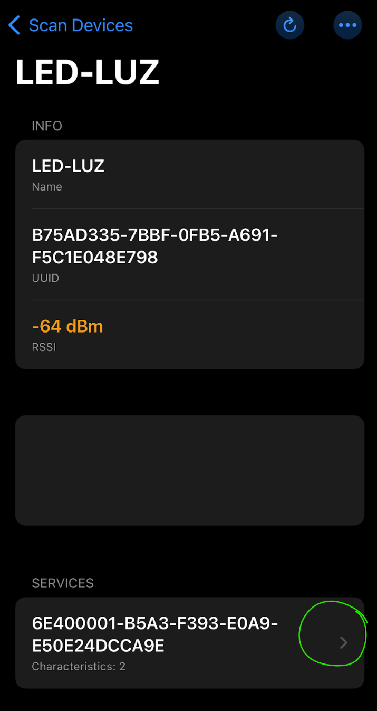

# Practica-2.6

### *2.6 Bluetooth + LED (blink) via App (o Flask u otro medios)  móvil /laptop*

El ambiente en el que se realizó fue en Thonny con Micropython, haciendo uso de la Pico W.
_Se utilizaron los componentes necesarios para encender el led que tiene integrado la Pico_
_haciendo uso de la Pico W, un protoboard y un cable micro usb_

**Código principal de la práctica 2.6**
```python
#Jiménez Rivera Paulina 20211796

#librerías importadas
import bluetooth
import random
import struct
import time
from machine import Pin
from ble_advertising import advertising_payload
from micropython import const

_IRQ_CENTRAL_CONNECT = const(1) #constante para evento de conexión
#constante para evento de desconexión entre dispositivo periférico y central
_IRQ_CENTRAL_DISCONNECT = const(2)
#constante relacionada a la escritura de datos
_IRQ_GATTS_WRITE = const(3)

#banderas para leer, escribir y notificar
_FLAG_READ = const(0x0002)
_FLAG_WRITE_NO_RESPONSE = const(0x0004)
_FLAG_WRITE = const(0x0008)
_FLAG_NOTIFY = const(0x0010)

#servicio UART que permite la comunicación entre un dispositivo periférico
#y uno central a traves de canales de transmisión y recepción 
_UART_UUID = bluetooth.UUID("6E400001-B5A3-F393-E0A9-E50E24DCCA9E")
_UART_TX = (
    bluetooth.UUID("6E400003-B5A3-F393-E0A9-E50E24DCCA9E"),
    _FLAG_READ | _FLAG_NOTIFY,
)
_UART_RX = (
    bluetooth.UUID("6E400002-B5A3-F393-E0A9-E50E24DCCA9E"),
    _FLAG_WRITE | _FLAG_WRITE_NO_RESPONSE,
)
_UART_SERVICE = (
    _UART_UUID,
    (_UART_TX, _UART_RX),
)

#clase junto con el nombre con el que aparecerá la pico en el móvil
class BLESimplePeripheral:
    def __init__(self, ble, name="LED-LUZ"):
        self._ble = ble
        self._ble.active(True)
        self._ble.irq(self._irq)
        ((self._handle_tx, self._handle_rx),) = self._ble.gatts_register_services((_UART_SERVICE,))
        self._connections = set()
        self._write_callback = None
        self._payload = advertising_payload(name=name, services=[_UART_UUID])
        self._advertise()

#definición de función para conectar y desconectar
    def _irq(self, event, data):
        if event == _IRQ_CENTRAL_CONNECT:
            conn_handle, _, _ = data
            print("New connection", conn_handle)
            self._connections.add(conn_handle)
        elif event == _IRQ_CENTRAL_DISCONNECT:
            conn_handle, _, _ = data
            print("Disconnected", conn_handle)
            self._connections.remove(conn_handle)
            self._advertise()
        elif event == _IRQ_GATTS_WRITE:
            conn_handle, value_handle = data
            value = self._ble.gatts_read(value_handle)
            if value_handle == self._handle_rx and self._write_callback:
                self._write_callback(value)

#definición de función para iniciar conexión
    def send(self, data):
        for conn_handle in self._connections:
            self._ble.gatts_notify(conn_handle, self._handle_tx, data)

    def is_connected(self):
        return len(self._connections) > 0
    
    def is_disconnected(self):
        return len(self._connections) < 0 

    def _advertise(self, interval_us=500000):
        print("Starting advertising")
        self._ble.gap_advertise(interval_us, adv_data=self._payload)

    def on_write(self, callback):
        self._write_callback = callback

#definición de función que recibe la entrada que se ingrese
        #1 equivale a encender led y 0 a apagarlo
def demo():
    led_onboard = Pin("LED", machine.Pin.OUT)
    ble = bluetooth.BLE()
    p = BLESimplePeripheral(ble)

    def on_rx(v):
        print("RX", v)
        if v == b'1':
            led_onboard.on()
            print("LED encendido")
        elif v == b'0':
            led_onboard.off()
            print("LED apagado")
        else:
            print("Comando no reconocido")

    p.on_write(on_rx)
    
    while True:
        pass

if __name__ == "__main__":
    demo()
```

**Código de la librería "ble_advertising.py" de la práctica 2.6**
```python
#Jiménez Rivera Paulina 20211796

#librerías importadas
from micropython import const
import struct
import bluetooth

_ADV_TYPE_FLAGS = const(0x01)
_ADV_TYPE_NAME = const(0x09)
_ADV_TYPE_UUID16_COMPLETE = const(0x3)
_ADV_TYPE_UUID32_COMPLETE = const(0x5)
_ADV_TYPE_UUID128_COMPLETE = const(0x7)
_ADV_TYPE_UUID16_MORE = const(0x2)
_ADV_TYPE_UUID32_MORE = const(0x4)
_ADV_TYPE_UUID128_MORE = const(0x6)
_ADV_TYPE_APPEARANCE = const(0x19)

def advertising_payload(limited_disc=False, br_edr=False, name=None, services=None, appearance=0):
    payload = bytearray()

    def _append(adv_type, value):
        nonlocal payload
        payload += struct.pack("BB", len(value) + 1, adv_type) + value

    _append(
        _ADV_TYPE_FLAGS,
        struct.pack("B", (0x01 if limited_disc else 0x02) + (0x18 if br_edr else 0x04)),
    )

    if name:
        _append(_ADV_TYPE_NAME, name)

    if services:
        for uuid in services:
            b = bytes(uuid)
            if len(b) == 2:
                _append(_ADV_TYPE_UUID16_COMPLETE, b)
            elif len(b) == 4:
                _append(_ADV_TYPE_UUID32_COMPLETE, b)
            elif len(b) == 16:
                _append(_ADV_TYPE_UUID128_COMPLETE, b)

    if appearance:
        _append(_ADV_TYPE_APPEARANCE, struct.pack("<h", appearance))

    return payload


def decode_field(payload, adv_type):
    i = 0
    result = []
    while i + 1 < len(payload):
        if payload[i + 1] == adv_type:
            result.append(payload[i + 2 : i + payload[i] + 1])
        i += 1 + payload[i]
    return result

def decode_name(payload):
    n = decode_field(payload, _ADV_TYPE_NAME)
    return str(n[0], "utf-8") if n else ""

def decode_services(payload):
    services = []
    for u in decode_field(payload, _ADV_TYPE_UUID16_COMPLETE):
        services.append(bluetooth.UUID(struct.unpack("<h", u)[0]))
    for u in decode_field(payload, _ADV_TYPE_UUID32_COMPLETE):
        services.append(bluetooth.UUID(struct.unpack("<d", u)[0]))
    for u in decode_field(payload, _ADV_TYPE_UUID128_COMPLETE):
        services.append(bluetooth.UUID(u))
    return services

def demo():
    payload = advertising_payload(
        name="micropython",
        services=[bluetooth.UUID(0x181A), bluetooth.UUID("6E400001-B5A3-F393-E0A9-E50E24DCCA9E")],
    )
    print(payload)
    print(decode_name(payload))
    print(decode_services(payload))

if __name__ == "__main__":
    demo()
```

**Aplicación usada:**


**Proceso para encender el led por medio de Bluetooth:**
1. Ingresar a la aplicación y buscar el nombre que se le asignó a la Pico W


2. Presionar en el apartado de servicios como se muestra en la siguiente imagen:


3. Dirigirse a la parte de abajo de la pantalla donde se presenta la opción de "Terminal"


4. Ingresar los valores indicados para encender o apagar el led:

*Led de la Pico encendido (1):*

 
 

*Led de la Pico apagado (0):*


_Resultados en la terminal de Thonny_


